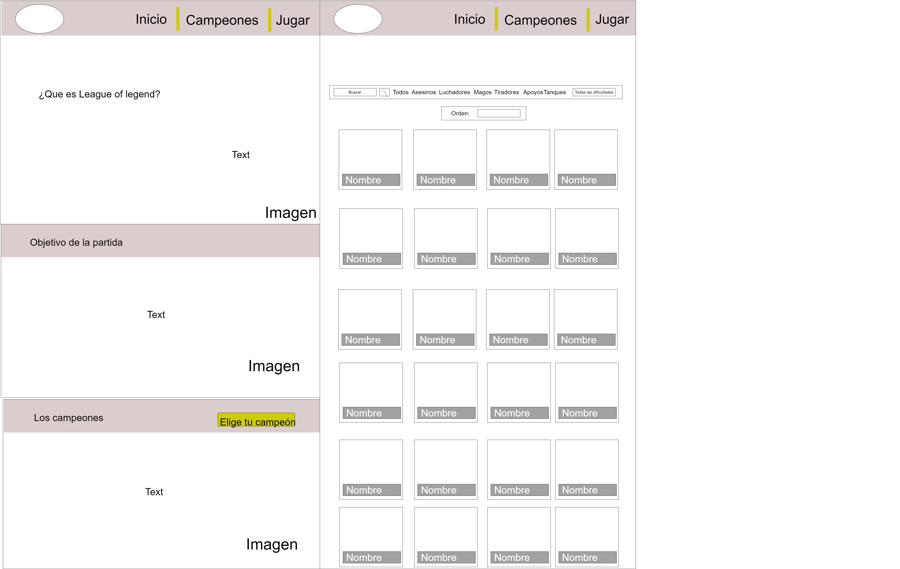

# League of Legends

## Índice

* [1. Resumen del proyecto](#1-Resumen-del-proyecto)
* [2. Proceso del diseño](#2-Proceso-del-diseño)

***

## 1. Resumen del proyecto

En el siguiente proyecto construimos una pagina web dirigida al juego League of Legends, en la cual nuestros usuarios puedan visualizar un grupo de datos que se adecuen a sus necesidades.

El objetivo de dicha pagina es que el usuario pueda visualizar los datos de los campeones, filtrarlos, ordenarlos y obtener un promedio en base a los niveles de dificultad.

## 2. Proceso del diseño

### Público Objetivo

Los usuarios a los que va dirigida esta web son jugadores principiantes o personas sin experiencia, que deseean adentrarse al mundo de League of Legends, pero no tienen conocimientos sobre los campeones, los cuales son indispensables en cada partida.

### Historias de Usuario

1. Yo como usuario quiero visualizar la información de la pagina, para entender mejor el mundo de League of Legends.
2. Yo como usuario principiante quiero filtrar a los campeones para obtener un resultado mas rapido.
3. Yo como usuario quiero ordenar a los campeones por orden alfabetico para acceder a mi campeón por su nombre
4. Yo como usuario quiero obtener un promedio de la dificultad de los campeones para saber cuales son los mas fuertes o mas debil 

 Además, cuenta con una sección especial para los campeones, en los que se podrá 
La sección de campeones cuenta con distintos modos de filtrado como lo son: roles, orden alfabético y niveles de dificultad

### Idea

Como ya tenemos la data de los campeones, la idea es crear una pagina web donde el usuario pueda conocer de una manera sencilla a los campeones, encontrando información relevante sobre cada uno de ellos, como, por ejemplo: ataque, defensa, magia y dificultad.

Para que la pagina no solo sea de campeones, le agregamos una pagina principal que cuenta con información básica
sobre qué es el juego, cuál es el objetivo de cada partida y qué son los campeones

### Prototipado

* Prototipo de baja fidelidad

En primer lugar, realizamos un boceto sobre lo que seria la pagina de inicio sobre League of Legends, esta tendria una barra centrada para poder moverse a la pagina de campeones, pero por temas de diseño decidimos colocarla en el inicio de la pagina, al realizar el test nos dimos cuenta que faltaba un boton en la parte final de la pagina para redirigir al usuario a la pagina de campeones, sin tener que volver a subir hasta el inicio de pagina.

El segundo boceto hace referencia a la pagina donde se visualizarán los campeones, ademas tiene una barra donde podra filtrar los roles, y en la parte superior dos inputs donde podra ordenar o buscar a dichos campeones, al momento de realizar el test comprobamos que
el boton calculo, lo podias poner una manera mas dinamica en la barra, por medio de los niveles de dificultad, por lo tanto, rediseñamos la barra de navegación, colocando un nuevo input de todos los niveles y aumentando el input de buscar.

* Prototipo de alta fidelidad

Creamos nuestro prototipo en figma, decidimos realizar una pagina para el inicio y otra para los campeones. El inicio cuenta con una barra superior, la cual redireccionará a la pagina de campeones o al juego en si, tambien contara con información importante del juego. En la otra página, "Elige tu campeón" se visualizarán en cartas todos los campeones, al hacer click sobre cada uno de ellos, se abre una ventana donde muestra su información mas relevante, como lo son: Niveles de ataque, defensa, magia y dificultad. En la parte superior cuenta con una barra de navegación, su función es filtrar a los campeones, ya sea por medio de su rol, orden alfabético o niveles de dificultad, para hacer este ultimo estamos sacando un promedio para poder filtrarlo solo por facil, medio o dificil. Ademas añadimos un buscar donde se podrá buscar a un campeón de manera más rápida y sencilla.

